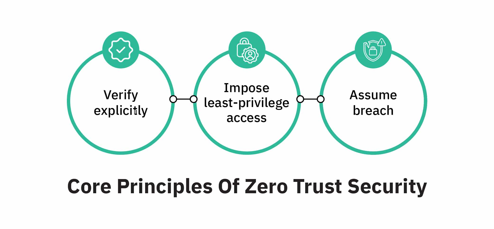
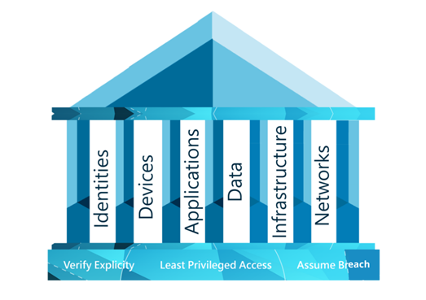
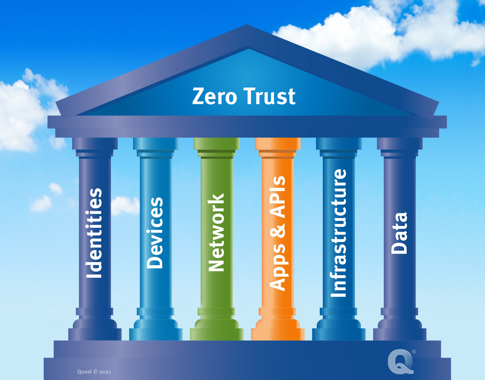

# Zero-Trust-Framework
Brief introduction about zero trust framework.

<h2>Description</h2>
Zero Trust teaches us to <b>“trust no one, always verify”</b>. <br/>
Instead of assuming everything behind the corporate firewall is safe, the Zero Trust model assumes breach and verifies each request as though it originates from an open network.
<br/>Every access request is fully authenticated, authorized, and encrypted before granting access.<br/> Micro- segmentation and least-privilege access principles are applied to minimize lateral movement.

<br />


<h2>Why Zero Trust? </h2>

- In the new generation of advanced cyber-attacks,  there is a need of new security model that more effectively adapts to the complexity of the modern environment, embraces the hybrid workplace, and protects people, devices, apps, and data wherever they’re located.

<h2>Zero Trust principles</h2>
Zero trust works on 3 principles: <br />

<p align="center">
Zero Trust Principles: <br/>

<br />

<b>1.	Verify explicitly</b>   <br />
•	Always authenticate and authorize based on all available data points, including user identity, location, device health, service or workload, data classification, and anomalies.<br />
<b>2.	Use least-privilege access: </b>   <br />
•	Limit user access with just-in-time and just-enough access (JIT/JEA), risk-based adaptive polices, and data protection to help secure both data and productivity. <br />
<b>3.	Assume breach:</b>     <br />
•	Minimize blast radius and segment access. Verify end-to-end encryption and use analytics to get visibility, drive threat detection, and improve defenses.<br />

<h2> Zero Trust pillars: </h2>

<p align="center">
Zero Trust Pillars: <br/>

<br />

Microsoft describes 6 pillars for Zero trust strategy.    <br />
<b>1. Identities</b>   <br />
-Verify and secure each identity with strong authentication across your entire digital estate.  <br />
<b>2. Endpoints</b>      <br />
-Gain visibility into devices accessing the network. Ensure compliance and health status before granting access.   <br />
<b>3. Apps</b>   <br />
-Discover shadow IT, ensure appropriate in-app permissions, gate access based on real-time analytics, and monitor and control user actions.   <br />
<b>4. Data</b>   <br />
-Move from perimeter-based data protection to data-driven protection. Use intelligence to classify and label data. Encrypt and restrict access based on organizational policies.  <br />
<b>5. Infrastructure</b>   <br />
-Use telemetry to detect attacks and anomalies, automatically block and flag risky behavior, and employ least-privilege access principles.    <br />
<b>6. Network</b>    <br />
-Ensure that devices and users aren’t trusted just because they’re on an internal network. Encrypt all internal communications, limit access by policy, and employ microsegmentation and real-time threat detection.


<h2>How to implement the Zero Trust:</h2>
<br/>
<p align="center">

<br />
<br />

<br />
<br />


</p>

<!--
 ```diff
- text in red
+ text in green
! text in orange
# text in gray
@@ text in purple (and bold)@@
```
--!>
